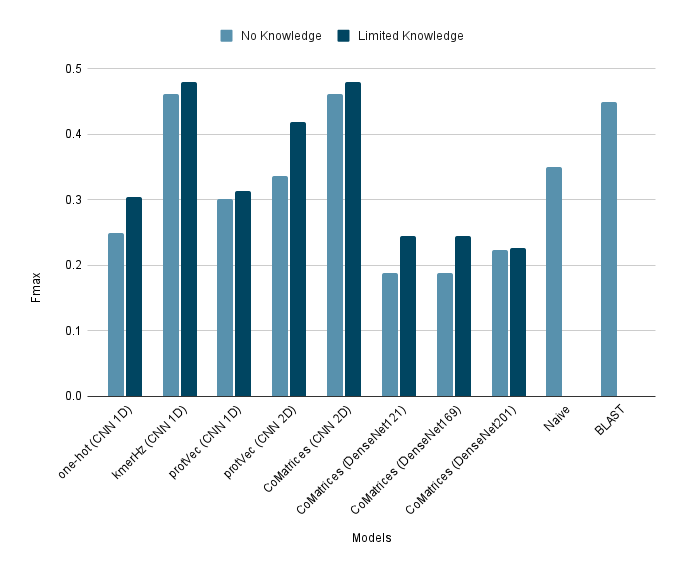

# GOlite

## description

GOlite is a python package that trains different Neural Network models for protein function prediction. It adapts to different encodings by building dynamic structures. It's designed to train on encoded data produced by [protEncoder](https://github.com/anazhmetdin/protEncoder).

## Available Structures

### 1. Convolutional Neural Network (CNN)

In this package, 1D and 2D are available to choose from based on the input shape. The network structure uses the following elements:

-   binary cross-entropy loss
-   Adam optimizer
-   ReLU activation function in the hidden layers
-   Sigmoid activation function in the final classification layer
-   filters size changes in each layer and it's selected by the user and follows this pattern: start,end,step
-   filters count is selected by the user
-   one fully connected layer in the end
-   MaxPooling layer is added after each filter in order to avoid overfitting

### 2. Dense Convolutional Network (DenseNet)

figures from [[1]](https://openaccess.thecvf.com/content_cvpr_2017/html/Huang_Densely_Connected_Convolutional_CVPR_2017_paper.html)

DenseNet implementation in Keras is not as flexible as CNN, therefore, we had to use the provided structures without adjustments. There are three prebuilt designs with different depths: DenseNet121, DenseNet169, and DenseNet201. DenseNet is considere superior to CNN in the image classification field in terms of efficiency and accuracy.

## Input

for more input options see the package documentation:

> GOlite --help

## Output

### Training

-   Model folder for each epoch.
    -   Folder name pattern: outPrefix_modelType_epochNumber
-   Five Images plotting the following measurements across training and validation subsets in all epochs so far.
    -   AUC
    -   Loss
    -   Mean Squared Error (MSE)
    -   Categorical Accuracy
    -   Categorical Cross Entropy
-   Five npy files storing the model performance measurements in all the previous epochs

### Prediction

-   One npy file for each batch storing encoded labels vectors.
    -   File name pattern: inputFile_prdcts.npy
-   One npy file for each batch storing the probabilities for each label and for all proteins.
    -   File name pattern: inputFile_prdctsCert.npy

## Getting started

### Installing the package

-   Download the latest release: [releases](https://github.com/anazhmetdin/GOlite/releases)

-   In your command line environment:

> pip install path/to/GOlite-x.x.x-py2.py3-none-any.whl

### Run an example

-   In your Command Line environment:

> GOlite -d m1000_s50_n1000_part*\_onehot.npy" -l m1000_s50_n1000_part*\_FGOA.npy" -o oneHot -e 100 -b 500 -f 64 -s 8,64,8

## Performance

### Fmax scores of GOlite models

These scores were acquired following CAFA3 instructions

### Fmax scores ot the top GOlite models agains the top models in CAFA3 and published Deep-Learning-Based models

These scores are acquired using NK, and full evaluation modes

For more details on the experiment methodology please refere to my [thesis](https://drive.google.com/file/d/119PgriNl-DWFwMUt7Tm9_lMelILdKT_a/view?usp=sharing) or contact me through the email
